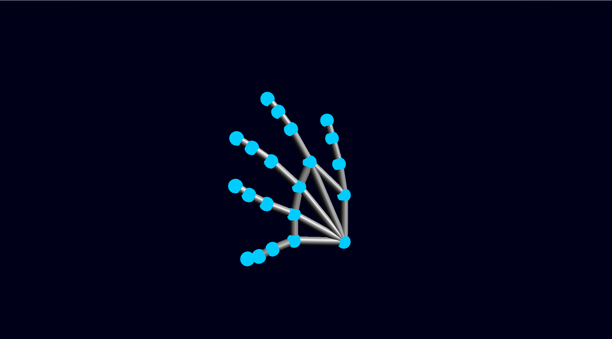
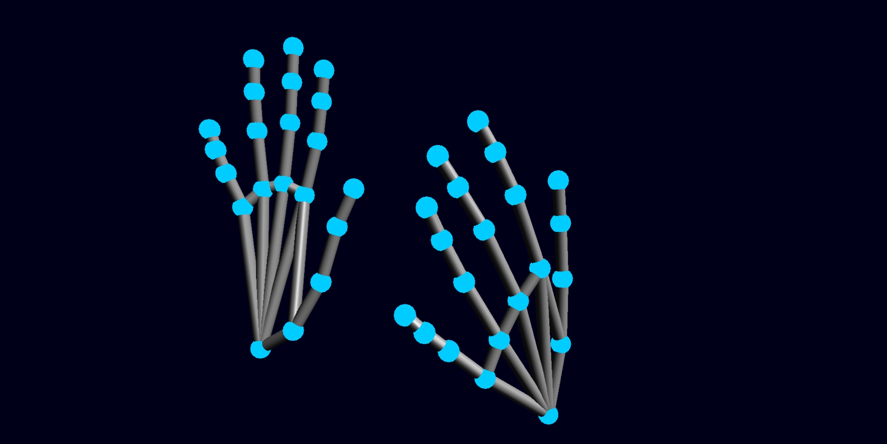
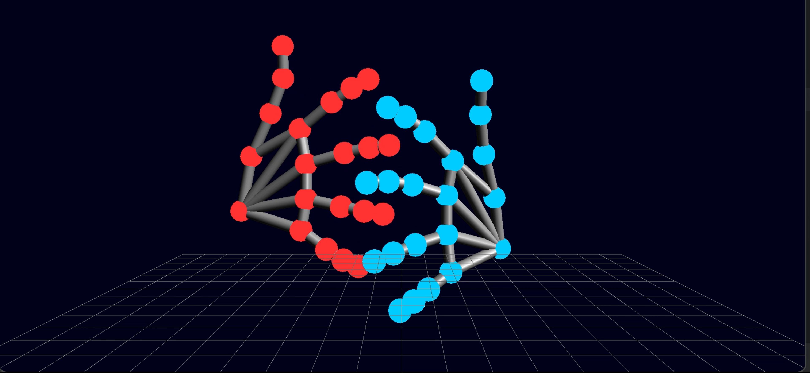
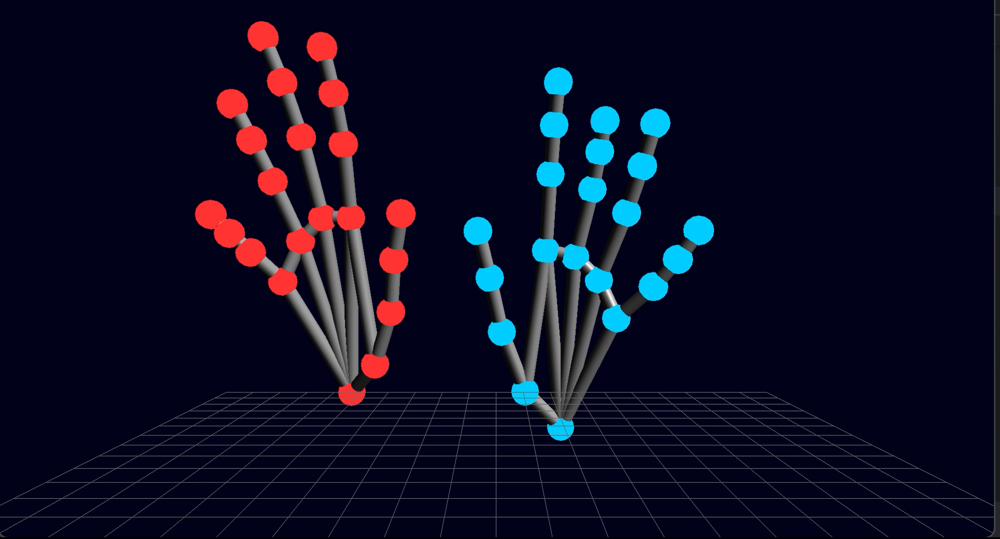

# SciFi-3D-Hand-Tracking
Real-time hand tracking using OpenCV, Mediapipe, and OpenGL. Captures hand movements via webcam and renders a 3D sci-fi-inspired skeletal visualization with a neon grid. Supports dual-hand tracking, high-res input, and interactive 3D rendering for AR/VR, gesture control, and immersive visuals. 

🚀 A futuristic dual-hand tracking system using OpenCV, Mediapipe, and OpenGL for real-time 3D visualization of hand movements.

## 📌 Features
- 🎮 **Real-time Hand Tracking**: Utilizes MediaPipe's hand tracking model to detect and track multiple hands in real time. The model tracks 21 key landmarks on each hand for precise movement detection.
- 🔷 **3D OpenGL Rendering**: The hand landmarks are visualized in 3D space using OpenGL, allowing for interactive, rotating, and scaling hand skeletons in a sci-fi style.
- 🎨 **Holographic Effects**: The 3D hand model is displayed with a neon-colored, holographic effect, simulating a futuristic interface.
- 🖥️ **High-Resolution Processing**: The system supports HD video resolution (1920x1080) to capture finer details and improve the accuracy of hand tracking.
- 🔳 **Holographic Grid (hand_tracking_with_grid.py)**: A sci-fi holographic grid is drawn beneath the hands, adding depth to the scene and creating a visual reference point for hand movements.
- 💻 **Dual-Hand Support**: The system can simultaneously track two hands, allowing users to interact with the environment in a more dynamic way.
- 🌐 **Cross-Platform Compatibility**: Works on multiple platforms (Windows, Mac, Linux) as long as the required dependencies are installed.

## 🛠️ Installation
Clone this repository:
```sh
git clone https://github.com/your-username/SciFi-Hand-Tracking.git
cd SciFi-Hand-Tracking
```

Install dependencies::
```sh
pip install -r requirements.txt
```

Run the program:
```sh
python src/hand_tracking_with_grid.py
```

## 📸 Screenshots
Here are some screenshots showcasing the hand tracking and holographic effects:






## 🎥 Demo Video
Check out the live demo on [LinkedIn].
